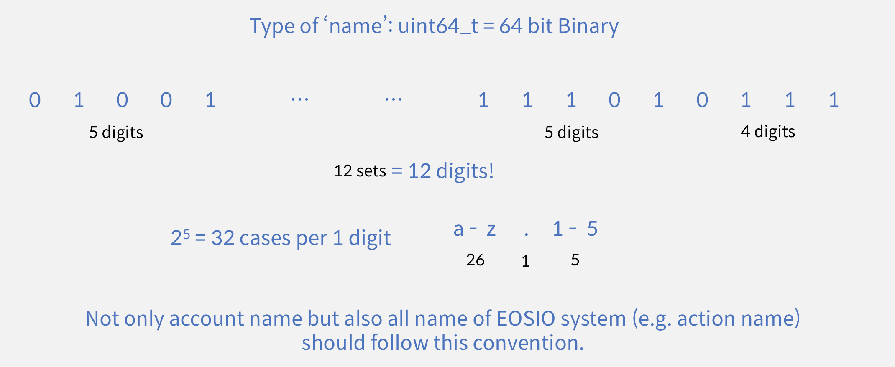

## EOSIO names

*  Applies to accounts, actions, and any other EOSIO encoded names
*  Encoded in a 64-bit unsigned integer (`uint64_t`)
*  First twelve characters, if any, encoded in `base32` using characters a-z, 1-5, and dot (.)
*  13th character, if any, encoded in `base16` using characters a-j, 1-5, and dot (.)
*  Although the encoding allows it, the software enforces that the last character cannot be a dot (.) regardless of the name length.
*  Account names are further restricted between 1 and 12 characters (13th character not allowed)

## Encoding and decoding

EOSIO name objects can be created, encoded, and decoded via the `eosio::name` class.

1. To encode a string into an EOSIO name object, use an appropriate `eosio::name()` constructor.
2. To decode an EOSIO name object into a string, use the `eosio::to_string()` function.
