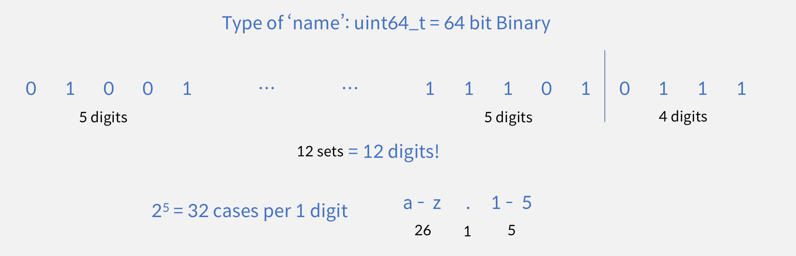

When implementing EOSIO smart contracts and when storing data in an EOSIO blockchain, it is important to follow the established EOSIO conventions for naming accounts, actions, tables, etc.

## EOSIO names

*  Applies to all EOSIO encoded names (accounts, actions, tables, etc.)
*  Encoded as a 64-bit unsigned integer (`uint64_t`) on the blockchain.
*  First 12 characters, if any, encoded in `base32` using characters: `.`, `1-5`, `a-z`
*  13th character, if applicable, encoded in `base16` using characters: `.`, `1-5`, `a-j`

### Standard account names

*  Must contain exactly 12 characters from the `base32` set: `.`, `1-5`, `a-z`
*  13th character not allowed or lesser than 12 characters
*  Must start with a lowercase letter `a-z`
*  Must not end in a dot `.` character

### Non-standard account names

*  May contain between 1 and 12 characters from the `base32` set: `.`, `1-5`, `a-z`
*  13th character not allowed in account name
*  Must not end in a dot `.` character

### Table, struct, class, function (action) names

*  May contain between 1 and 13 characters.
*  First 12 characters, if any, from the `base32` set: `.`, `1-5`, `a-z`
*  13th character, if any, from the `base16` set: `.`, `1-5`, `a-j`

### Format

The figure below showcases a 12 character string formatted into a 64-bit unsigned integer. Note: the 13th char, if any, contains 2<sup>4</sup> = 16 cases per 1 digit (char): 1 (`.`) + 5 (`1-5`) + 10 (`a-j`).



## Encoding and decoding

EOSIO name objects can be created, encoded, and decoded via the `eosio::name` class.

1. To encode an `std::string` into an EOSIO name object, use the appropriate `eosio::name()` constructor.
2. To encode a `char *` string literal into an EOSIO name object, you can also use the `""_n` operator.
3. To decode an EOSIO name object into an `std::string`, use the `eosio::to_string()` function.

### Examples

```cpp
auto eosio_user = eosio::name{user};  //encodes user string to eosio::name object
auto user_str = user_name_obj.to_string(); //decodes eosio::name obj to string
auto standard_account = "standardname"_n;  //encodes literal string to eosio::name
auto non_standard_account = ".standard"_n; //encodes literal string to eosio::name
```
